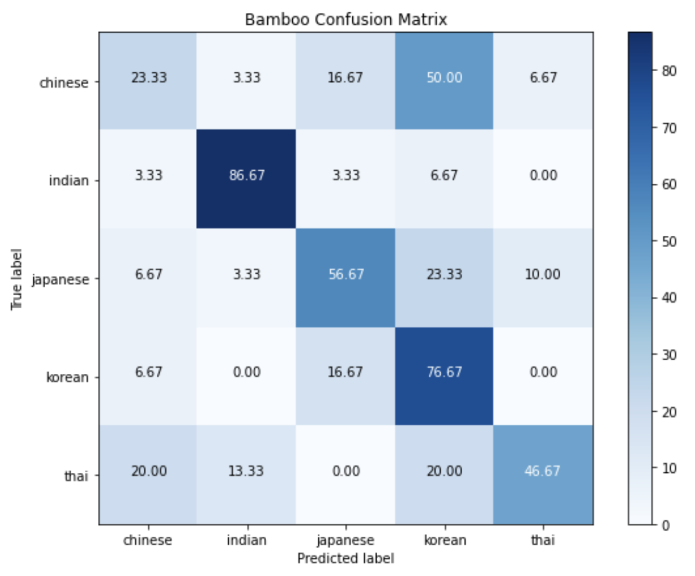

This repository trains a supervised machine learning model to predict the country of origin of a recipe on the basis of the ingredients used in it using a decision tree.

First, we split the dataset into two parts: a test set and a training set. We start by training a decision tree on the training dataset with information about various recipes from different cuisines and the ingredients they used. Then, we generate a decision tree of desired depth and explore the various nodes created. Finally, we test our model on the test set and study the results using a confusion matrix.

## Table of Contents

1. [About the Data](#0) 
2. [Preprocessing](#1) 
3. [Data Modeling](#2) 
4. [Model Evaluation](#3) 
5. [Scope for Further Development](#4) 

## About the data 

In 2011, Yong-Yeol Ahn, Sebastian E. Ahnert, James P. Bagrow and Albert-László Barabási published a research paper on _Flavor network and the principles of food pairing_. The paper explored the existence of general patterns that determine the ingredient combinations used in food today or principles that transcend individual tastes and recipes. During their research, they scraped tens of thousands of food recipes (cuisines and ingredients) from three different websites, namely:

|                                                             All Recipes                                                             |                                                            Epic Curious                                                             |                                                             Menu Pan                                                             |
| :---------------------------------------------------------------------------------------------------------------------------------: | :---------------------------------------------------------------------------------------------------------------------------------: | :------------------------------------------------------------------------------------------------------------------------------: |
|  |  |  |
|                                                         www.allrecipes.com                                                          |                                                         www.epicurious.com                                                          |                                                         www.menupan.com                                                          |

Read the research summary [here](http://yongyeol.com/papers/ahn-flavornet-2011.pdf).

## Preprocessing 

Since the researchers have already processed and compiled the dataset, it is fairly reliable and easy to understand. However, we will take the following steps to clean the dataset :

1. Fix column names
2. Change the cuisine names for better readability
3. Remove data for cuisines with less than < 50 recipes to avoid a convoluted decision tree with too many nodes
4. Convert all the Yes's and No's to 1's and 0's for easy processing

Now, we can use this data to build a supervised decision tree which, given a set of recipe ingredients, will predict the recipe's cuisine.

## Data Modeling 

### Removing dataset bias

A preliminary examination of the dataset shows that while we have data on a multitude of cuisines, there is a clear bias towards American recipes. To ensure that our decision tree is not biased towards American cuisine, we can either exclude American recipes from the dataset or build decision trees for different subsets of the data. In this project, we will adopt the latter solution, i.e., build a decision tree based solely on Asian cuisines.

### Setting tree depth

After some trial and error, a tree depth of fifteen was found to be optimal for the decision tree. It is important to understand that a tree with a lot of nodes will be biased towards the dataset it was trained on. On the other hands, not having enough nodes will fail to capture the complexity of the dataset provided.

For instance, here is a decision tree of depth=3 :

A decision tree with depth=17 :

## Model Evaluation 

### Splitting dataset into training and test sets

The easiest way to evaluate the model is to split the given dataset into two parts - a training set and a test set. We train the model on the training set and then test it on the test set. First, let's look at how many recipes the dataset has for Asian cuisines :

| Cuisine  | Number of Recipes |
| :------: | :---------------: |
|  Korean  |        799        |
|  Indian  |        598        |
| Chinese  |        442        |
| Japanese |        320        |
|   Thai   |        289        |

We can generate a test set by taking 30 recipes from each cuisine at random. Here's the decision tree with depth=15 created from the remaining data:

### Inspecting accuracy using confusion matrix

Once the decision tree is created, we can use a **confusion matrix** to explore how well the decision tree performed.

In a confusion matrix, the rows represent the actual cuisines from the test set and the columns represent the cuisines predicted by the decision tree. Each row will sum to 100, and a perfect model should ideally have a 100.00 score for each block in the diagonal.

For instance, by looking at the first row in the confusion matrix, we can see that 60% of the **Chinese** recipes in the test set were correctly classified, although 37% were misclassified as **Korean** and 3% were misclassified as **Indian**.

We can see that our model is fairly accurate for recipes from Indian and Korean cuisines, with 86.67% and 76.67% accuracies respectively.

## Scope for Further Development 

- Using a dataset without an American cuisine bias for a better model that covers more cuisines.
- Evaluating the model on data not from this dataset.
- Visualizing the accuracy of the decision tree model with a different visualization tool.
